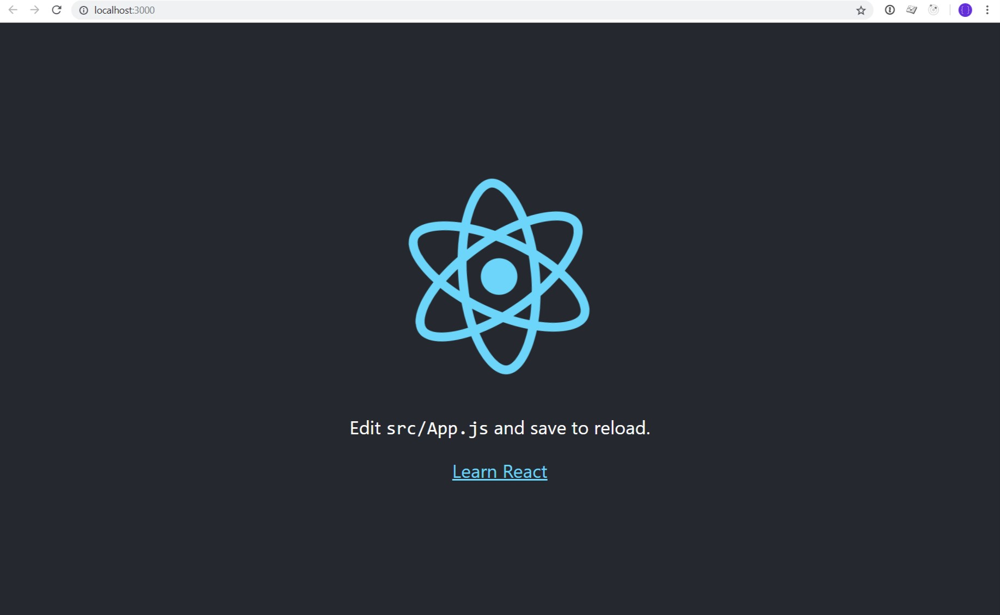

# Introduction to Web Development Course

In this introductory course we will be covering the following technologies:

- Command line
- Git
- Github
- Yarn
- HTML
- CSS
- JavaScript
- ReactJS
- Visual Studio Code

The course will walk you through most of what you need to do in order to complete the development of a Todo application which you can then use to manage your daily priorities.  It will cover the most basic of skills in order to become a good web developer and will give you a taste of what it’s like to work in the industry.  Hopefully, you will enjoy the course and want to take the next step to becoming a commercial Web Developer.

# Learning the basics of HTML

## Elements

## Attributes

# Learning the basics of CSS

## Classes

## Properties

# Learning the fundamentals of JavaScript

## Strings


## Integers


## Variables

### var

### let

### const


## Arrays


## Objects


## Functions


## Classes

# Working on your Todo Project

## Command Line and Git

To start off with, we will need to become comfortable working with the command line as this will be the place to go to start a new project and to save our work on [GitHub](https://github.com).  Github is an online repository in which we can save versions of our code.  It is a great site that the majority of web developers use to host their code.  GitHub is integrated with git, a command line application used for saving versions of your code locally and also for pushing your changes up to the GitHub website.

### Installing git and preparing to start our project

1. Install git.  
    - If you are on a windows machine, then you will want to install [git bash](https://gitforwindows.org/). When following the interactive installer, using the default settings should be fine.
    - If you are on a mac `git` should be installed by default.

2. Open up a command prompt
- On windows, you will want to run the application `Git Bash`
- On Mac, the application is called Terminal

3. Now make a folder to hold all of your future projects in, type: `mkdir workspace`

4. Then change into the workspace directory, type `cd workspace`.  This is where we will be creating our Todo app project

### Initialising the project

To initialise our React Todo project we will first need to install YARN, yarn is a package manager for JavaScript which allows you to install different libraries that you might need when building JavaScript applications.

1. Install yarn:
     - If you are on Windows then you can download the yarn installer from the following: https://yarnpkg.com/en/docs/install, you will also need to install NodeJS https://nodejs.org/en/download/
     - On a mac, it is best to first install [homebrew](https://brew.sh/) and then run `brew install yarn` from the Terminal

2. Initialise our new project, type: `yarn create react-app my-todo` this will create a new folder called `my-todo` in our workspace directory and create all the necessary files and folders we need to start working with our React application.

3. Change into the newly created directory `cd my-todo`

4. Now start your application to check that everything is working as intended `yarn start`. This should boot the application and open a new tab with the following screen: 



If you can see this screen then you are good to go.

### Setting up our github account and repository

Now that we have something to begin building our Todo application with, we first want to make sure that we are tracking any changes we make to our code so that we can undo any mistakes we might make at a later date.  To do this, we will use git, our version control app of choice and team it up with GitHub, an online service which allows us to store our code securely in the cloud.

1. Open another terminal window

2. Navigate into your project directory again, this should be possible with `cd workspace/my-todo`

3. Now that we are in our app folder, we can create a new git repository, `git init`.  
    - `create-react-app` may have done this automatically for us already, but it's good to just go through the motions anyway as not all packages will do this for us automatically.

4. With our repository initialised, we now want to create an account on GitHub and link our todo project with our github project.
    - [Create an account on github](https://github.com/join?source=header-home)
    - [Start a new project on github](https://github.com/new) name the repository `my-todo`
    - You should now be presented with a screen to either create a new repository locally or add it to an existing repository, follow the instructions for `…or push an existing repository from the command line`

5. Now that we have linked our local repository with our github project we can save what we have so far and push it up to github
    - `git add -A` - This will add all of the files we have created so far so that we can create our first git commit.
    - `git commit -m "Initial commit"` - this will create a commit with the message "Initial commit" in our local repository. This commit is now stored so that if we make any changes later which we want to undo, we can rollback to this point in our project at any time.
    - `git push origin master` - will now push these local changes up to our github account so that they are stored in the cloud, this way if anything happens to our computer and we end up losing all of our work, we can always get our code back from GitHub instead. (here `origin` refers to GitHub and `master` is the name of the branch we want to push to)
    - Once you have done that, we can now go back to our GitHub repository page in the browser and refresh the page. Your files and folders show now all be visible

## Installing a text editor

We are now very close to being able to start writing the code to our new application, but first we need to install an editor to write our code with.

For ease of use and simplicity I would recommend using Visual Studio Code, it's free, open source and is becoming more and more popular with web developers across the world.

1. Install [Visual Studio Code](https://code.visualstudio.com/)

2. Open Visual Studio Code and then go to File > Open Folder > select the 'my-todo' folder and open it

### Branching off of master

Now that we are in a position to start coding, we should first start a new git branch.  A branch in git is the equivalent to copying the work we currently have to a new location so that we can start to make changes to it without the worry of breaking or deleting any important code we currently have.  Once we have finished making any changes we want, and are happy with the results, we can then merge those changes back into our original work.

If we now go back to our terminal window where we ran the command `git push origin master` we can create a new branch for us to start making changes.

1. First check we are still on the master branch `git status`. It should return:
    ```
    On branch master
    nothing to commit, working tree clean
    ```
    This means that we haven't made any changes to our project after we pushed up our previous changes.

2. Now that we have confirmed that we haven't made any changes we can go ahead and create a new branch based off of `master`
    ```
    git checkout -b feature/basic-todo-functionality
    ```
This will create a new branch called `feature/basic-todo-functionality` and change our working branch to the new one.

## How react works

### Components

### Classes

### Render

### Constructor

### Callbacks

### Imports

### State

### this

## Writing your first bit of code

Now that we have everything in place we need to start building our app, let's start to get down to some serious coding!  All the code we need to worry about at this point is located under the `src` directory.

### First we'll start off by renaming the `App` files to `Todo` to give us a bit more context:

1. Rename the file `App.js` to `Todo.js`

2. Inside `index.js` change the line `import App from './App';` to `import Todo from './Todo';` so that it imports our renamed file and then update `ReactDOM.render(<App />, document.getElementById('root'));` to `ReactDOM.render(<Todo />, document.getElementById('root'));` so that React knows which component it should render.

3. Save the file `index.js`

4. Remove the files `App.css` and `logo.svg` from the `src` directory as we will be creating our own CSS from scratch later.

5. Inside `Todo.js` remove the following lines:
    ```javascript
    import logo from './logo.svg';
    import './App.css';
    
    ``` 
    Otherwise our app will fail and raise an error as the files no longer exist.

6. Inside `Todo.js` rename any references from `App` to `Todo`, there should be 3.

7. Save the file

8. Rename `App.test.js` to `Todo.test.js`

9. Inside `Todo.test.js` rename any occurrences of `App` to `Todo` (there should be 3) and save the file.

10. Finally in your terminal run `yarn test` to check that our updated test is still passing.  You should see something like the following:
    ```
    PASS  src/Todo.test.js
      √ renders without crashing (32ms)

    Test Suites: 1 passed, 1 total
    Tests:       1 passed, 1 total
    Snapshots:   0 total
    Time:        2.855s
    Ran all test suites.

    Watch Usage: Press w to show more.
    ```

11. Press `q` to quit out of the test suite

    You should also now see in your browser, where we have removed the logo and styling of the default app:
    ```
    Edit src/Todo.js and save to reload.

    Learn React
    ```
    We will replace this content in the next section.

12. Now would be a good time to ensure we have saved any files we have edited and commit our changes to git.
    - Check you have saved all the files we have edited
    - In your terminal, run the command `git status`. This should print out a list of changes.  This can be useful for checking what files you are about to add and commit to git.
    - Run `git add -A` to add all files, including those deleted, so that they are ready to be committed.
    - Run `git commit -m "Renamed files"` this will create a new commit with the message `renamed files`

13. Now we can push these changes to GitHub for storage in case anything happens to our local machine and end up losing all the work we have done.
    - `git push origin feature/basic-todo-functionality` this will push any commits we have made locally to origin (in this case our github account) to the branch `feature/basic-todo-functionality`

### Adding a form to create new todo items

Let's start by adding a form to our app so that you can begin to add items to your todo list.

1.  Replace the contents of the `render()` function in the `Todo.js` class with the following:
    ```javascript
    return (
      <form>
        <div>
          <input type='text' placeholder='What would you like to do?' name='todoItem' autoComplete='off' />
          <button type='submit'>Add</button>
        </div>
      </form>
    );
    ```
 - save the file and go back to your browser, you should now see an input field with the text `What would you like to do?` and a button with the text `Add`

2. You'll find that when you type something in and click `Add` nothing actually happens.  That's because we haven't told React to do anything with our data yet, so we'll do that next.

3. To save items that we add to our todo list we will use React's built in state to accomplish this:
 - Create a `constructor()` function above our `render()` function (`...` will denote other code not shown for the purpose of the example)
    ```javascript
    ...
    class App extends Component {
      constructor () {
      }

      render () {
        ...
      }
    }
    ...
    ```

4. Then inside our constructor function we need to call `super()` so that it calls any original code that React has in place for a React Component to work correctly (this code is not visible to us, but exists within the internals of React itself)

5. On a new line below our call to `super()` we will set the default state for the todo list and the default input value for our todo item:
    ```javascript
    this.state = {
      todos: [],
      value: ''
    }
    ```
Here we are setting the state to an object which has a key called 'todos' (which we will refer to later in our app) and then assign it an empty array `[]`. We assign it an empty array, so that it is clear to us or any other developer which may work on the project, that we intend to propagate 'todos' with a list of items.

We have also added the 'value' key to our state, as this will log the todo item value from our input field.

6. Now we need to create a function that will get called when we click the button 'Add', to update this state with a new item and a function that will get called when we type text into the input field.
    - We'll call the first function `addItemToTodo()` so that it is clear as to what it actually does.
    - This will then add the item we type in the input field into the 'todos' key of our React state.
    - The second function will be `handleChange()` which will log what is typed into the input field.
    - Then we will need to update our `render()` function to display these items on the page.

7. Create the function `addItemToTodo()` and `handleChange()` below your `constructor()` function:
    ```javascript
    constructor () {
    ...
    }

    addItemToTodo () {

    }

    handleChange () {

    }

    render () {
      ...
    }
    ```

8. Next we'll have them both accept the argument `event`
    ```javascript
    addItemToTodo (event) {

    }

    handleChange (event) {

    }
    ```

9. We also need to tell React not to treat the form in the traditional sense, where it makes a request and then reloads the page; we want to stay on the current page and just update the state:
    ```javascript
    addItemToTodo (event) {
      event.preventDefault() // Do not submit the form and cause the page to refresh

    }
    ```

    We'll also use the event to pull out what the user has typed and save it to the state so that we can use it to add to our todo list later

    ```javascript
    handleChange (event) {
      this.setState({
        value: event.target.value
      })
    }
    ```

10. Next we'll save the value of the text input into a variable for us to use later by adding it to the 'todos' state.
    ```javascript
    addItemToTodo (event) {
      event.preventDefault() // Do not submit the form and cause the page to refresh
      const item = this.state.value
    }
    ``` 
    `this.state.value` here refers to the content in the input field that the user types in as a todo item.

11. Clear the input field

    As we are preventing the page from refreshing, we will want to reset the value of the input field that the user initially entered.  If they want to add another todo item, they won't need to first delete the contents within the input field.
    ```javascript
    addItemToTodo (event) {
      event.preventDefault() // Do not submit the form and cause the page to refresh
      const item = this.state.value

      this.setState({
        value: ''
      })
    }
    ``` 
    Here we are setting the value of the input field back to an empty string for the users convenience.

12. Insert the input value into the 'todos' state:
    ```javascript
    addItemToTodo (event) {
      event.preventDefault() // Do not submit the form and cause the page to refresh
      const item = this.state.value

      this.setState({
        todos: [item],
        value: ''
      })
    }
    ``` 
    Here we are updating the 'todos' state to be an array with one value of `item`, the content that was entered into the input field.

13. Allow our new `addItemToTodo()` and `handleChange()` functions have access to `this`

    In our `addItemToTodo()` and `handleChange()` functions we are accessing React's state through the use of `this` but our functions will be referring to a different version of `this`, therefore we will need to give it access.  To do this, we will need to add another line to our `constructor()` function:
    ```javascript
    constructor () {
      super()

      this.state = {
        todos: [],
        value: ''
      }

      this.addItemToTodo = this.addItemToTodo.bind(this)
      this.handleChange = this.handleChange.bind(this)
    }
    ```

14. Finally, the last piece of the puzzle is to tell our form to use our new `addItemToTodo()` function when we submit the form (when clicking on the 'Add' button):
    ```javascript
    <form onSubmit={this.addItemToTodo}>
    ```
    And for our input field to call `handleChange()` whenever something is typed into the input field:
    ```javascript
    <input type='text' placeholder='What would you like to do?' value={this.state.value} name='todoItem' autoComplete='off' onChange={this.handleChange} />
    ```

15. Testing our new functionality

    Now if we go back to the browser and type something into the input field and click 'Add' it should add our new item to the 'todos' list state.  Go ahead and give it a try.

16. Hmmm

    When we click 'Add' it doesn't seem like it does anything still, does it?  This is because we haven't told React what to do with our new 'todos' state.  First, let's check the state is being updated.
    - Add the line `console.log(this.state.todos)` so that it is on the next line within our `render()` function:
      ```javascript
      render () {
        console.log(this.state.todos) // Print out the `todos` state into the browsers console
        return (
          ...
        )
      }
      ```
    - Go back to the browser and right click on the page and choose `inspect`, then click on the tab called `console`.  This is the JavaScript console of the browser, which will show you any data we put in `console.log()` and also any potential errors or bad practices that may be occurring within your app which React will inform us of automatically.
    - Now try typing something in your input field again and clicking 'Add'.
    - You should now see something like `["hello"]` in your browsers console.  This confirms that our `addItemToTodo()` function is working as intended; our 'todos' state is now an array with one value, the value you just typed into the input field.

17. Displaying your todo list in your todo app.

    Now that we've confirmed that we are adding items to our todo list through the console, let's update our `render()` function to display them on the page:

    - We'll create a new function called `buildTodoList()` to generate our list of todos to display on the page.
    - Add a call to this function in our `render()` function.
    - Remove the `console.log(this.state.todos)` line.
    - Add a fragment (<></>) around our HTML in the `render()` function.
    - Use the text from our todo item as the key (this should be safe to do as there shouldn't be an instance where we have two todo items which are exactly the same.  If this is a concern for you, then you could add validation to ensure that all items are unique)

    ```javascript
    ...

    buildTodoList () {
      const { todos } = this.state

      return todos.map(todo => {
        return <li key={todo}>{todo}</li>
      })
    }

    render () {
      return (
        <>
          <form onSubmit={this.addItemToTodo}>
            <div>
              <input type='text' placeholder='What would you like to do?' value={this.state.value} name='todoItem' autoComplete='off' onChange={this.handleChange} />
              <button type='submit'>Add</button>
            </div>
          </form>
          <ul>
            {this.buildTodoList()}
          </ul>
        </>
      );
    }

    ...
    ```
    Here we are pulling out the 'todos' value from our state and assigning to a `todos` variable.  We are then creating a new array using the `map()` function with the values of our list items.

    Next we insert theses values as returned from the `buildTodoList()` function into an unordered list.

18. Whenever we change or implement a piece of functionality we should test it first by hand, this is called QA (quality assurance); we need to check that things work as we intended them to.
    - Go ahead and add some items to your todo list to check that it's working as intended.

19. You might have noticed that it is not quite working as intended, you can successfully add items to your todo list, but every time you add a new one, it replaces your old one.  The maximum number of items we can ever have is one, not exactly ideal.
- Take this time to have a look through your code to see if you can spot where this might be happening.  It can often help to place `console.log()` (and passing it an argument) throughout your code to help find where the route cause is, or you might want to use the [debugger within Visual Studio Code](https://code.visualstudio.com/docs/editor/debugging).  If you do use `console.log()`, remember to take them out later.  If you manage to find the cause, don't worry too much about trying to fix it yourself, we will do it in the next step.

20. Fixing our list so that it doesn't replace old items.

    As you may have identified, the problem lies with the `addItemToTodo()` function.  It simply replaces our 'todos' state with the most recent item, thus throwing away any previous items.
  
    Let's go ahead and update this function so that it works as intended:
    - Pull out our current 'todos' state into a variable
    - Add new todo item to our previous list of todos
    - Update the state with our new todo list

    ```javascript
    addItemTodoList (event) {
      event.preventDefault()
      const item = this.state.value
      const { todos } = this.state

      todos.push(item)

      this.setState({
        todos: todos,
        value: ''
      })
    }
    ```

    Save the `Todo.js` file and then check that everything is now working as intended in the browser

    In the next part of the course, we will focus on creating a `todoItem` component, which also allows us to mark an item as completed.

    This would also be the perfect time for us to commit our changes to git and push to github.  If you need help remembering how to do this, refer back to where we did this earlier.  Remember to use a descriptive message for the commit, rather than reusing the previous one.

### Creating our todoItem component

  Now that we are in a position to add more functionality to our todo items, it would be a good time to create another component so that it can manage it's own state.

  - Create a new component called `todoItem`
  - Import the component into our `Todo` component
  - Add a checkbox so that we can mark a todo item as done
  - Pass the todo text from `Todo` into the `TodoItem` props

1. Create a new file in the `src/` directory called `TodoItem.js`

2. Create a new class called `TodoItem` which extends `Component` and add a `render()` funtion.
    ```javascript
    import React, { Component } from 'react'

    class TodoItem extends Component {
      render () {
        
      }
    }

    export default TodoItem

    ```

3. Update the `render()` function to return a checkbox and the todo item text.

    ```javascript
    const { item } = this.props

    return <>
      <input type='checkbox' name='todoItem' /> {item}
    </>
    ```
    You'll notice here that we are also pulling out a value called `item` from the props.  We'll update `Todo` now to pass this value to the props of `TodoItem`

4. Update the `buildTodoList()` function in `Todo` to use the new `TodoItem` component and pass the todo text value to `TodoItem` as a prop and import `TodoItem`

    ```javascript
    import TodoItem from './TodoItem'

    ...

    buildTodoList () {
      const { todos } = this.state

      return todos.map(todo => {
        return <li key={todo}>
          <TodoItem item={todo} />
        </li>
      })
    }
    ```

    Now if you go back to your browser and add a new todo item you should see a checkbox next to it.  At this point if you click on the checkbox it doesn't mark the item as completed.  We will first need to track this in the state of our `TodoItem` component and then add styling through the use of CSS to make it look completed visually.

5. Update `TodoItem` to track the state of completed items.
    - Add a `constructor()` function to set the default state
    - Add a `markAsDone()` function to update the state
    - Update the render function to pass through the done state and update the styling

    Let's begin by editing `TodoItem` and adding our `constructor()` function

    ```javascript
    ...
    constructor () {
      super()

      // Set our default state for the todo item as not done
      this.state = {
        done: {}
      }

      // Delegate this to markAsDone
      this.markAsDone = this.markAsDone.bind(this)
    }
    ...
    ```
    Now we can add our `markAsDone()` function to update the item as done when clicked on.

    ```javascript
    ...
    markAsDone (event) {
      // Use the checkbox value from the form and change the text to strikethrough if the checkbox is checked
      if (event.target.checked) {
        this.setState({done: {textDecoration: 'line-through'}})
      } else {
        this.setState({done: {}})
      }
    }
    ...
    ```

    Finally, we can update our `render()` function to pull in the `done` state and use the `onClick()` callback of the checkbox to call our `markAsDone()` function.

    ```javascript
    ...
    render () {
      // Assign our done state to a variable
      const { done } = this.state
      const { item } = this.props

      return <span style={done}> 
        <input onClick={this.markAsDone} type='checkbox' name='todoItem' /> {item}
      </span>
    }
    ...
    ```

    Now if we go back to the browser, add a new item and click the checkbox it should put a strikethrough across the text. Unchecking it should then do the opposite.

6. Commit your changes to git and push to github

### Deleting todo items

Next we'll add the ability to delete todo items.
 - Add `deleteItem()` function to `Todo`
 - Pass `deleteItem()` function to `TodoItem` component as a prop
 - Add delete link to `TodoItem`

1. Add the `deleteItem()` function to `Todo`

    ```javascript
    ...

    deleteItem (item) {
      const { todos } = this.state

      // Remove the todo item from the todos array
      todos.splice(item, 1)

      // Update the todos state with our reduced list of todo items
      this.setState({
        todos: todos,
        value: ''
      })
    }

    ...
    ```

2. Update `buildTodoList()` function to pass the `deleteItem()` function to `TodoItem` component

    ```javascript
    ...
    buildTodoList () {
      const { todos } = this.state
      
      return todos.map((todo, index) => {
        return <li key={todo}>
          <TodoItem item={todo} deleteItem={() => this.deleteItem(index)} /> 
        </li>
      })
    }
    ...
    ```

    Here we wrap the function `deleteItem()` in a function so it is only called when we click on `delete`.  If we only passed `this.deleteItem(index)` without first wrapping it in a function, then it would be called immediately.

3. Bind `this` to `deleteItem()`

    ```javascript
    constructor () {
      super()

      this.state = {
        todos: [],
        value: ''
      }
      this.addItemToTodo = this.addItemToTodo.bind(this)
      this.handleChange = this.handleChange.bind(this)
      this.deleteItem = this.deleteItem.bind(this)
    }
    ```

4. Update `TodoItem` to have a delete link and to call the `deleteItem()` function on click

    ```javascript
    render () {
      const { done } = this.state
      const { item, deleteItem } = this.props

      return <span style={done}>
        <input type='checkbox' onClick={this.markAsDone} name='todoItem' />
        {item}
        <button onClick={deleteItem} data-behavior='delete'>delete</button>
      </span>
    }
    ```

    Now when you add a todo item and click `delete` in the browser, it should remove that item from the list!

5. Commit your changes to git and push to github

## Making our todo list look a bit prettier

Now that we have the basic functionality of our todo list in place, we can start to concentrate on making it look a bit prettier.

### Defining the CSS directory structure

For our example app, we are going to use two CSS concepts called Block Element Modifier ([BEM](http://getbem.com/)) and Inverted Triangle CSS ([ITCSS](https://itcss.io/)).  These two methodologies will help to keep our CSS clean and more maintainable, especially if our project were to get particularly large.

So let's move on to defining our directory structure:

1. Create a `scss` folder in the `src` directory.

2. Create a `components` folder in our newly created `scss` folder.

    This is where the majority of our styling will live.

### Resetting styles

Every browser has it's own default styling built in, this is so that it can style basic elements in the event the web site does not have any CSS.  However, every browser does this differently, therefore we need to reset the browsers default styling before we start to overlap our own defined styles.  If we don't do this, then it increases the likelyhood that our site will look different on different browsers, and this is something that we don't want to be dealing with or at least minimising where possible.

1. Create a file called `reset.scss` in the root of our `scss` folder.

2. Head to [https://meyerweb.com/eric/tools/css/reset/](https://meyerweb.com/eric/tools/css/reset/) and copy the CSS on the page into your `reset.scss` file.

### Adding some base styles

Now that we have our reset in place, let's define some base styling, this will define how we want certain elements to look across the whole site.

1. Create the file `base.scss` in the root of our `scss` folder.

    Copy and paste the following styles:

    ```css
    body {
      font-size: 16px;
      margin: 0;
      padding: 0;
      font-family: -apple-system, BlinkMacSystemFont, "Segoe UI", "Roboto", "Oxygen",
        "Ubuntu", "Cantarell", "Fira Sans", "Droid Sans", "Helvetica Neue",
        sans-serif;
      -webkit-font-smoothing: antialiased;
      -moz-osx-font-smoothing: grayscale;
    }

    input {
      padding-left: 0.5em;
      border: 1px solid #d1d1d1;
    }

    input[type=checkbox] {
      margin-left: 0;
    }

    h1 {
      font-size: 2em;
      padding-top: 1em;
      padding-bottom: 1em;
    }

    p {
      margin-bottom: 1em;
    }

    ul, ol {
      padding-top: 1em;
    }

    li {
      padding-top: 1em;
    }
    ```

### Include the reset and base styling into our application

Now that we have defined the basic styling we need, we now have to import it into our app so that it can be picked up by the browser.

1. Create the file `index.scss` in the `scss` folder.

    We will use this file to import our `reset` and `base` styles.
    
    - In `index.scss`:
    ```css
    @import "./reset";
    @import "./base";
    ```

2. Update `index.js` to pull in our new `index.scss` stylesheet.

    - Update the line:
    ```javascript
    import './index.css';
    ```
    to: 
    ```javascript
    import './scss/index.scss';
    ```

3. Delete the file `index.css` as it's no longer needed.

    Now if you go back to the browser you should be presented with an error message.  It's basically stating that we are now using `.scss` files rather than regular CSS ones and it doesn't know how to interpret them. We'll need to install `node-sass` for that to work.

4. Open a new teminal window and `cd` to your `my-todo` folder.

5. Type in the following and press enter: `yarn add node-sass`.

6. Once that command has finished, go back to the terminal where you started your application.  Then press `ctrl+c` to cancel the running application (your todo react app). Then run `yarn start` again in that terminal.  This should then restart your application and open another tab in your browser.  At this point, your app should be running again without any errors and the styling of your app should start to look a little different.

### Adding styling to our form

1. Create a file called `c-form.scss` in the `scss/components` folder.

    Enter the contents:

    ```css
    .c-form {
      &__input-group {
        width: 100%;
        box-sizing: border-box;
        display: flex;
        
        input {
          flex-grow: 1;
        }
      }
    }
    ```

    Now we need update our HTML to use these classes.

    In the file `Todo.js` update the form to the following:

    ```javascript
    <form onSubmit={this.addItemToTodo} className='c-form'>
      <div className='c-form__input-group'>
        <input type='text' placeholder='What would you like to do?' value={this.state.value} name='todoItem' autoComplete='off' onChange={this.handleChange} />
        <button type='submit'>Add</button>
      </div>
    </form>
    ```

2. Create a file called `c-button.scss` in the `scss/components` folder.

    Enter the contents:

    ```css
    .c-button {
      border: 1px solid white;
      background-color: #6f31de;
      color: white;
      font-size: 1.1em;
      padding: 0.5em;
    }
    ```

    Now we need to update our HTML again to use this class.

    In the file `Todo.js` update the button to the following:

    ```javascript
    <form onSubmit={this.addItemToTodo} className='c-form'>
      <div className='c-form__input-group'>
        <input type='text' placeholder='What would you like to do?' value={this.state.value} name='todoItem' autoComplete='off' onChange={this.handleChange} />
        <button type='submit' className='c-button'>Add</button>
      </div>
    </form>
    ```

    Finally, we need to create a scss file for our `Todo.js` class which imports all the stylesheets we need specifically for this component.

3. Create the file `todo.scss` in `/src/scss` and add the following:

    ```css
    @import './components/c-form.scss';
    @import './components/c-button.scss';
    ```

4. Import the new `todo.scss` stylesheet into our `Todo` component:

    ```javascript
    import './scss/todo.scss'
    ```

    Now when you go back to your browser you should see that our input field and button look a little better.  The rest of the app should continue to function as intended.

### Adding styling to todo list

With our form out the way, we can now look at styling our todo list.

1. Create a file called `c-todo-item.scss` in the folder `src/scss/components/`:

    Enter the following contents in the newly created file:

    ```css
    .c-todo-item {
      display: flex;
      justify-content: space-between;

      &__task {
        padding-left: 1rem;
      }

      &__content {
        padding-left: 0.5em;
        font-weight: bold;
      }

      &__delete {
        color: darkred;
        padding-right: 1rem;
        border: 0;
        background: none;
      }
    }
    ```

2. Create a `todo-item.scss` file in `src/scss/` and import the CSS components we need:

    ```css
    @import "components/c-todo-item.scss";
    ```

3. Update the `TodoItem.js` file to make use of the new CSS classes:

    ```javascript
    return (
      <div className='c-todo-item'>
        <label className='c-todo-item__task'>
          <input type='checkbox' onClick={this.markAsDone} /><span style={done}>{item}</span>
        </label>
        <button onClick={deleteItem} className='c-todo-item__delete' data-behavior='delete'>Delete</button>
      </div>
    )
    ```

4. Update `TodoItem.js` to import it's stylesheet:

    ```javascript
    import './scss/todo-item.scss'
    ```

    Finally, let's refactor `TodoItem.js` a little to use a class for the strikethrough when a todo item is completed, rather than using the inline style we originally used.

5. Create a folder called `utilities` in the `scss/` folder.

6. Create the file `u-strikethrough.scss` in the folder `scss/utilities` and add the following:

    ```css
    .u-strikethrough {
      text-decoration: line-through;
      opacity: 0.5;
    }
    ```

    Update `scss/todo-item.scss` to import the new utility class:

    ```css
    @import "components/c-todo-item.scss";
    @import "utilities/u-strikethrough.scss";
    ```

7. Refactor the todoItem `<span>` to use our new utility class rather than inline styling.

    ```javascript
    render () {
      const { done } = this.state
      const { item, deleteItem } = this.props

      return (
        <div className='c-todo-item'>
          <label className='c-todo-item__task'>
            <input type='checkbox' onClick={this.markAsDone} /><span className={done}>{item}</span>
          </label>
          <button onClick={deleteItem} className='c-todo-item__delete' data-behavior='delete'>Delete</button>
        </div>
      )
    }
    ```

    As you'll see here, we are using the `classes` variable from our state to set the strikethrough class on the todo item text. So let's update our default state and function to update the classes when an item has been marked as done.

    Update the constructor:
    ```javascript
    constructor () {
      super()

      this.state = {
        done: 'c-todo-item__content'
      }

      this.markAsDone = this.markAsDone.bind(this)
    }
    ```

    Update the `markAsDone()` function:
    ```javascript
    markAsDone (event) {
      const classes = event.target.checked ? 'c-todo-item__content u-strikethrough' : 'c-todo-item__content'

      this.setState({
        done: classes
      })
    }
    ```

    You might notice a new pattern here: `true ? then : else`.  This is an inline if.  If the first part of the statement evaluates to `true`, in our case `event.target.checked`, then initiate the code after the `?`. If it evaluates to `false` then initiate the code after the `:`.

8. Commit your changes and push to Github

## Writing tests

### Why it is important to write automated tests?

Bugs are a nature of software/web development, we are only human at the end of the day.  However, there is something we can do to try and minimise the number and scale of bugs.

By writing automated tests for any code that we write, we can ensure that a feature works as intended. Additionally, we can ensure it fails as intended, if it receives incorrect information.  By having a test suite which makes these checks for us whenever we make changes to a code base, we can be confident that we haven't introduced any new bugs, or reintroduced old ones.

This also allows for us to clean up old code so that it is more maintainable, readable and scalable in future, in a confident manner.

Additionally, if something is hard to test, then more often than not it is because we have implemented code in a confusing manner and so having a test suite can also drive us forward by making code easier for us to read and change in future.

### What about Test Driven Development (TDD)? 

TDD is the process of writing tests before any code has been implemented.  This can be extremely helpful in ensuring that the code we write does what is intended, is covered by tests and also allows for writing cleaner code from the start.  However, sometimes it can be hard to know what to test before you have figured out a solution for the problem.  Therefore, it may not always be possible to follow a TDD approach.  Being flexible with your approach is often the best approach.

## Snapshot testing

First we are going to implement snapshot testing to ensure our components render correctly.  What snapshot testing does is render out any component(s) we select and creates a text file in the JSON format which represents all the data that the component comprises of and saves it for future reference.  If in future the saved snapshot and the new shapshot differ, our test suite will raise an error so that we can inspect the differences, determine if the change is intended (in this case we simply update the saved snapshot with the new one) or if it is a regression, in which case we can fix the regression until the two snapshots match again.

### Setting up the test suite

1. Install dependencies `yarn add --dev react-test-renderer enzyme enzyme-adapter-react-16`
2. Configure `Jest` (the library we use for writing tests) to use `enzyme` (a library from Airbnb to make testing more convenient)
   - Create a file called `setupTests.js` in `/src`:
    ```javascript
    import { configure } from 'enzyme'
    import Adapter from 'enzyme-adapter-react-16'
    configure({ adapter: new Adapter() })
    ``` 
3. Create a `__tests__` folder in `/src`

### Testing the TodoItem component

1. Rename `Todo.test.js` to `TodoItem.test.js`, move it to `__tests__` and replace the contents with the following:
    ```javascript
    import React from 'react'
    import TodoItem from '../TodoItem'

    import { shallow } from 'enzyme'

    describe('<TodoItem />', () => {
      it('should match the snapshot', () => {
        const wrapper = shallow(<TodoItem />)

        expect(wrapper).toMatchSnapshot()
      })
    })
    ```

    Here we are importing the libraries we need for the test (react) and then the component we want to test, in this case `TodoItem`.  Then we import the `shallow` function from `enzyme` which allows us to render the `TodoItem` component and none of it's children and then check this against the snapshot for the test.

2. If we now run our tests `yarn test` we should see that this test passes.

### Testing the Todo component

1. Create a file called `Todo.test.js` in `__tests__`

2. Add the contents:
    ```javascript
    import React from 'react'
    import Todo from '../Todo'

    import { shallow, mount } from 'enzyme'

    describe('<Todo />', () => {
      it('should match the snapshot', () => {
        const wrapper = shallow(<Todo />)

        expect(wrapper).toMatchSnapshot()
      })
    })
    ```

    This code should not be fairly self explanitory, as it is very similar to our previous test.

## Integration tests

Integration tests allow us to write tests that interact with the code as if it were a human using it, this is important as it tells us whether or not the logic we have writted works as intended.

1. Now we should also add tests to ensure that the functionality of our todo app works as intended:

    Add the following under the first `it` block ("should match the snapshot") in our `Todo.test.js` file:

    ```javascript
    ...

    it('should add a new item to the list', () => {
      // Load the whole component including it's children
      const wrapper = mount(<Todo />)

      // Find the input field
      const input = wrapper.find('[name="todoItem"]')

      // Type in the word 'test'
      input.simulate('change', { target: { value: 'test' } })

      // Find our 'Add' button and click it
      const button = wrapper.find('[type="submit"]')
      button.simulate('submit')

      // There should now be a todo item in the list
      expect(wrapper.find('.c-todo-item__content').text()).toEqual('test')
    })

    it('should mark the item as done', () => {
      const wrapper = mount(<Todo />)

      const input = wrapper.find('[name="todoItem"]')
      input.simulate('change', { target: { value: 'test' } })
      const button = wrapper.find('[type="submit"]')
      button.simulate('submit')

      // Find the checkbox for our todo item and click it
      const checkbox = wrapper.find('[type="checkbox"]')
      checkbox.simulate('click', { target: { checked: true } })

      // It should now be marked as done
      expect(wrapper.find('span').hasClass('u-strikethrough')).toEqual(true)
    })

    it('should remove the todo item', () => {
      const wrapper = mount(<Todo />)

      const input = wrapper.find('[name="todoItem"]')
      input.simulate('change', { target: { value: 'test' } })
      const button = wrapper.find('[type="submit"]')
      button.simulate('submit')

      expect(wrapper.find('span').length).toEqual(1)
      
      // Click the delete button for the todo item
      const del = wrapper.find('[data-behavior="delete"]')
      del.simulate('click')

      // It should now have been removed
      expect(wrapper.find('span').length).toEqual(0)
    })

    ...
    ```

2. If we now run our tests: `yarn test`, we should see that these tests also pass.

3. Commit your changes and push to GitHub.

4. Now that we have our basic functionality complete with styling and tests we can merge this work back into our `master` branch.

    - Log in to GitHub and navigate to your repository.  [Create a Pull Request](https://help.github.com/articles/creating-a-pull-request/), check your work by looking through the `files` tab and then [merge it into Master](https://help.github.com/articles/merging-a-pull-request/).

5. Pull these changes down onto your local machine for further development.

    - Go back to your terminal where you pushed your changes to GitHub.
    - Switch back to your `master` branch: `git checkout master`
    - Pull down the changes from GitHub: `git pull origin master`
    - You should see the list of files that have been changed printed out in the terminal.  If you now go back to Visual Studio Code, you should see those changes reflected in your project.

# Extensions

Now that you have had a basic introduction to web development with ReactJS, here are some extensions for you to try (listed in order of difficulty):

 - Update the CSS using media queries to make the app look good on both tablets and desktop screens
 - Change all of the CSS to your own design
 - Add CSS animations for adding todo items, marking them as complete and deleting them
 - Implement GraphQL (Apollo is a good client for making requests, graphcool is a good service for deploying a graphql server) to save your todo items so that you don't lose them if you refresh the page or close the browser
 - Add the concept of labels, so that you can classify your todos and filter by label
 - Build something of your own in ReactJS!
